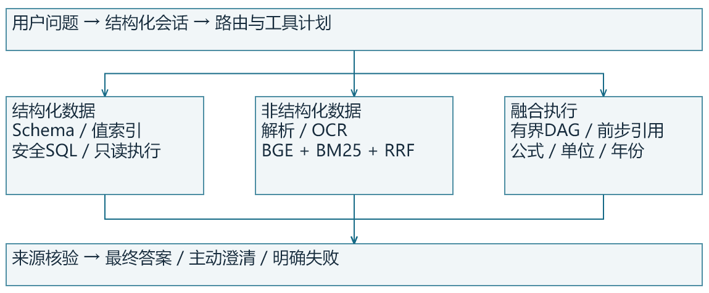

# 设计报告

设计目标、核心亮点、中级任务与验收边界

## 核心亮点预览（一）：架构与证据

系统面向“数据库里的数值”和“文档里的口径”需要共同回答的问题。结构化问数、独立知识库与跨源执行器共享来源契约；前端直接展示实际SQL、引用位置、计算参数和失败原因。

处理链路：用户问题→结构化会话→SQL/文档/跨源路由→有界工具执行→证据与单位校验→答案和可回看来源。PDF、DOCX、XLSX、TXT、MD、PNG入库后保留页、行、单元格或OCR区域定位。

| 当前验收 | 结果 | 口径 |
| --- | --- | --- |
| 问数开发验收 | 12/12 | 规则规划、合成开发题 |
| 多格式问答开发验收 | 11/11 | 混合检索、原文摘录与引用核对 |
| 跨源工具链开发验收 | 5/5 | 明确工具计划，非未知模型规划 |
| 公开Chinook开发题 | 12/12 | 公开库，人工题，非Spider基准 |
| 实际故障开发审计 | 4/10 → 10/10 | 临时文件/数据库/HTTP子服务，首次失败保留 |
| 真实gpt-6-luna | authentication_failed | models及responses探测401，未有模型成绩 |

## 核心亮点预览（二）：中级任务覆盖

| 要求 | 能力 | 当前证据 |
| --- | --- | --- |
| M01 | 要素识别、别名与改写 | NFKC、值词边界、5/5文本扰动 |
| M02 | 低示例跨领域 | Chinook 11表、0 few-shot，开发题12/12 |
| M03 | 主动澄清 | 指标、时间、值、JOIN歧义与回填 |
| M04 | 数十表Schema Linking | 11/40/80表干扰，9/9开发案例 |
| M05 | JOIN、聚合、嵌套 | 关系图、复合键、粒度与防扇出 |
| M06 | 文档公式与数据结合 | AST、来源绑定、单位与预测年份守卫 |
| M07 | 非标准目录 | 8份实际PDF首次2/8→8/8；原文件行号 |
| M08 | 复杂度自适应 | PageSignal及900字/80重叠复杂切片 |
| M09 | 低质OCR恢复 | 10种合成扰动，原图8/10→增强10/10 |

重点贡献是把公式、数值、单位、日期版本及工具依赖绑定到真实来源。缺失依据、政策重叠、零分母、币种冲突和已知预测年份不符均停止最终结论。

覆盖实现不代表所有官方未知测试均已通过。模型通用规划、独立保留题、公开OCR基准及跨源五轮真实模型评测仍需进一步验证。

## 需求与任务边界

依据 specification/official-track8.pdf（14页正式赛题），基础任务包括单表问数、单文档问答、可解释展示及交互Demo；中级任务涵盖九类难点；决赛需要多源协同、多跳、澄清与连续五轮。

本项目建立在独立目录中，迁移已有NL2SQL与未提交优化作为受保护基线。原生产项目仅作为只读借鉴源，不作为运行服务、私有知识库或密钥依赖。

| 对象 | 当前支持 | 边界 |
| --- | --- | --- |
| 数据库 | SQLite演示库与公开Chinook | 其他数据库方言未作运行验收 |
| 文档 | 15份实际文件、6种格式 | 合成样本，非真实客户资料 |
| 模型 | 指定Responses兼容接口 | 仅gpt-6-luna，鉴权尚未通过 |
| 交互 | 问数/知识库/验收工作台 | 本地开发服务，不声称完成生产审计 |

系统对无证据、歧义、错误计划和不可执行的查询显式返回状态；不会为提高表面完成率而使用猜测答案。

## 问数设计：意图与可执行口径

Schema自动解析表、字段、主外键与关系；值索引把“华东”等实际值绑定到正确列。Unicode归一化、繁简与别名处理降低输入差异；显式字段与最长字段匹配防止短词抢占长指标。

计划由指标、时间、过滤、分组、聚合、排序与JOIN结构组成。模型不直接执行裸SQL；同一安全门检查字段合法性、覆盖率、JOIN粒度和只读性。模糊意图进入澄清接口，用户选择后回填。

跨域扩展首先增加Schema和业务指标口径，而非为每一道题追加字符串模板。Chinook与干扰表实验证明有限场景可运行，尚不能推导任意业务数据库准确率。

五轮会话示例：2025华东销售额→改华南→改2024→换订单数→换华北。结构化条件替换避免把前轮已撤销条件误叠加。

## 多模态与检索设计

文本PDF优先保留原生文本与页块，扫描PDF和图片调用RapidOCR ONNX CPU。DOCX段落、XLSX行列、TXT/MD标题路径保留结构。低质量图片执行有界增强并保留原始结果。

BGE-small-zh-v1.5固定公开revision与SHA，以CLS归一化向量提供真正Dense检索。BM25提供精确词匹配，RRF融合排名。明确编号先作为范围约束，避免CASE0005与CASE00050混淆。

知识库原文件内容寻址，保存SHA与定位片段。答案可以回看原文件；定位、原文和数字核验失败时拒绝把候选片段包装为确定结论。

开发阈值0.35/0.6未经过独立校准；OCR置信度选优是工程启发式，不是语义正确保证。

## 跨源设计：每一步都有来源

执行计划每步包含id、tool和args，最多16步；ref/path定义实际依赖。运行前拒绝循环、缺失依赖、重复ID和未知工具。SQL或文档结果只有通过契约后才能作为后步参数。

| 场景 | 依赖链 | 核验 |
| --- | --- | --- |
| 客单价 | 文档公式→SQL销售额/订单数→计算 | 来源与零分母 |
| 预测 | PDF公式→SQL基准→Excel增长率 | 年份与单位 |
| 地区问数 | Excel地区→SQL过滤 | 实际单元格与地区 |
| 冠军经验 | SQL排名→冠军实体→文档检索 | 实体与引用 |
| 阈值比较 | 文档检索→Excel阈值→比较 | 来源与数值 |

已核对例子：2025华东销售额29584，按来源增长率12%得到2026预测33134.08。错年份停止，不显示该中间数值为最终答案。该结果仅用于合成样本验收。

## 评估设计与当前结果

| 评测 | 结果 | 解释 |
| --- | --- | --- |
| 问数开发验收 | 12/12 | 规则规划、合成开发题 |
| 多格式问答开发验收 | 11/11 | 混合检索、原文摘录与引用核对 |
| 跨源工具链开发验收 | 5/5 | 明确工具计划，非未知模型规划 |
| 公开Chinook开发题 | 12/12 | 公开库，人工题，非Spider基准 |
| 实际故障开发审计 | 4/10 → 10/10 | 临时文件/数据库/HTTP子服务，首次失败保留 |
| 真实gpt-6-luna | authentication_failed | models及responses探测401，未有模型成绩 |

本地468项回归覆盖接口、安全、语义与拒绝路径；一个Starlette弃用警告不影响当前通过，但需在依赖升级时处理。

同一组十项实际临时副本故障首次4/10，修复后10/10；原文件篡改或缺失停止旧切片与公式链，SQL缺库/锁定停止后步，硬kill子服务重启后五轮和pending澄清继续，会话锁503后解锁保留原历史。仅为开发审计，不代表掉电容灾。

结果匹配优先比较执行后的行与列，不把SQL字符串相等当作准确率。问答同时检查预期事实与引用；OCR对比原图与同一扰动样本，避免无对照的增强宣传。

计划下一阶段冻结独立保留题、引入未知Schema、遮蔽开发答案后实测；模型验证必须检查provider/model及回退状态，不允许混入规则结果。

## 效率、成本与工程取舍

| PDF页数 | 切片数 | 全局语义热P50/ms | 全局语义热P95/ms |
| --- | --- | --- | --- |
| 10 | 50 | 21.154 | 21.897 |
| 100 | 500 | 113.635 | 134.712 |
| 500 | 2500 | 523.822 | 618.806 |

以上是实际文字PDF入库后的混合检索与摘录答案，不含OCR与外部生成。500页全局语义热P50=523.822ms、P95=618.806ms，首次全局回答5.390s。首次全局编码、首载模型与热缓存分别报告；当前首次全局并不是新进程完整冷启动。编号查询不代表一般语义延迟。

数据库已实测1千、1万、10万行；10万行热简单查询约11.6ms、嵌套约77.2ms、同比约291.7ms。1/4/8线程规则查询约13.63/28.44/33.93QPS，不当作模型吞吐。

优化优先顺序：缓存Schema/向量、预热模型、索引和限定候选，再控制工具调用与上下文长度。API计费和端到端token成本因401尚未实测，不给虚构费用。

## 交付与部署

完整资产包包含源码、Schema、15份实际样本、公开BGE权重、Chinook与许可。runtime凭据、日志、缓存及基线ZIP不进入交付包。依赖锁定文件记录当前实测环境，跨平台安装仍需对应平台wheel。

启动：python -m pip install -r delivery/requirements-tested.txt；python tools/run_server.py --port 8030。打开首页、knowledge.html和capabilities.html。API模式先probe通过，再加--with-model；未通过时保留显式规则/摘录模式。

验包工具核对逐文件SHA，在全新目录解包并重建数据库、样本入库、随机端口启动，验证health、前端、SQL、Dense、RAG与OCR。当前检查点通过，最终材料加入后需再次验包。

组委会Word/PPT模板尚未提供，本材料采用匿名自定义排版，不声称已套用官方模板。最终提交前应按届时模板迁移，并补录真实模型及保留集结果。

